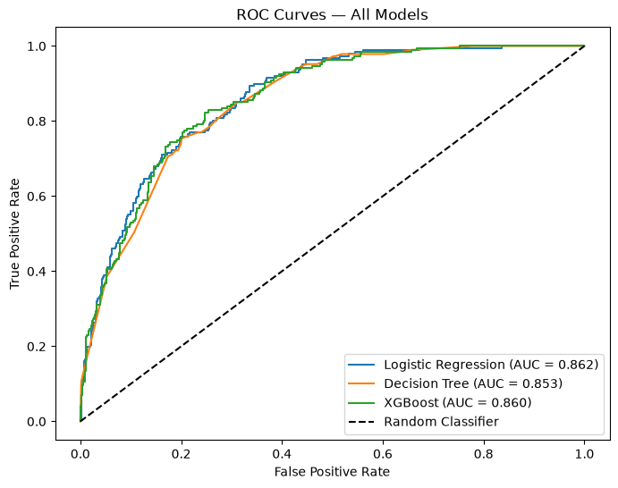
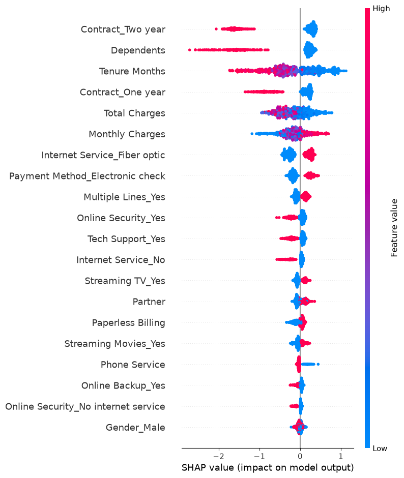
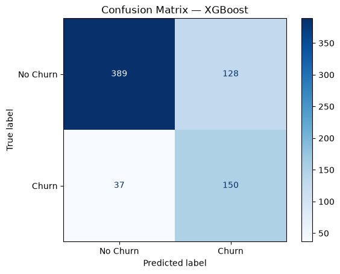

# Customer Churn Prediction API

A production-shaped ML system that predicts telecom customer churn probability and explains **why** the model made each prediction — served via a FastAPI REST API, tracked with MLflow, and containerized with Docker.

---

## What It Does

Given a customer's account details, the API returns:
- **Churn probability** (0 to 1)
- **Risk tier** (High / Medium / Low)
- **Top 5 factors** that drove the prediction (SHAP values)

```json
POST /predict

{
  "churn_probability": 0.8146,
  "prediction": 1,
  "risk_tier": "High",
  "top_factors": {
    "Tenure Months": 0.584,
    "Contract_Two year": 0.352,
    "Internet Service_Fiber optic": -0.328,
    "Monthly Charges": 0.248,
    "Contract_One year": 0.224
  }
}
```

---

## Architecture

```
Raw Data (Telco Customer Churn)
        ↓
  preprocess.py         clean → encode → split → scale
        ↓
   train.py             Logistic Regression / Decision Tree / XGBoost
        ↓
  evaluate.py           Metrics + Confusion Matrix + ROC + SHAP plots
        ↓
  MLflow Tracking       Experiment comparison across all 3 models
        ↓
  models/model.pkl      Best model saved to disk
        ↓
  api/main.py           FastAPI serves predictions with SHAP explanations
        ↓
  Docker Container      Portable, deployable anywhere
```

---

## Model Results

Trained and compared 3 models on the same dataset and same evaluation metrics. All tracked in MLflow.

| Model | F1 Score | ROC-AUC |
|---|---|---|
| **XGBoost** | **0.5904** | **0.8211** |
| Logistic Regression | 0.5873 | 0.8217 |
| Decision Tree | 0.5820 | 0.8029 |

**Why F1 is the primary metric:** The dataset is imbalanced (73% No Churn, 27% Churn). Accuracy alone is misleading — a model predicting "no churn" for everyone scores 73% accuracy but catches zero churners. F1 penalises both false positives and false negatives.

**Why ROC-AUC matters here:** At 0.82, XGBoost correctly ranks a random churner above a random non-churner 82% of the time — threshold-independent.

XGBoost was selected as the final model and saved to `models/model.pkl`.

---

## Evaluation Plots

### ROC Curves — All 3 Models


### SHAP Feature Importance (XGBoost)


### Confusion Matrix (XGBoost)


---

## Key Engineering Decisions

**Class imbalance handling:** 27% churn rate would make naive models ignore the minority class. Used `class_weight="balanced"` for sklearn models and calculated `scale_pos_weight` for XGBoost.

**Data leakage prevention:** `Churn Score`, `CLTV`, and `Churn Reason` columns are derived from churn outcomes — including them would leak the answer into features. All three are dropped before training. Scaler is fit only on training data and applied identically at inference.

**SHAP explainability:** XGBoost's built-in feature importance tells you what matters globally. SHAP tells you why the model made a specific prediction for one customer — per-prediction explanation returned in every API response.

**Shared preprocessing:** `preprocess.py` is imported by both `train.py` (training) and `api/main.py` (inference). Same functions, same transformations — no risk of train/serve skew.

---

## Tech Stack

| Layer | Tool |
|---|---|
| ML | scikit-learn, XGBoost |
| Explainability | SHAP |
| Experiment Tracking | MLflow |
| API | FastAPI + Pydantic |
| Server | Uvicorn |
| Serialization | Joblib |
| Containerization | Docker |
| Testing | Pytest |

---

## Project Structure

```
churn-prediction-api/
├── data/                   # Raw dataset (gitignored)
├── notebooks/
│   └── 01_eda.ipynb        # Exploratory data analysis
├── src/
│   ├── preprocess.py       # Shared preprocessing functions
│   ├── train.py            # Training pipeline
│   └── evaluate.py         # Metrics, plots, SHAP
├── api/
│   ├── main.py             # FastAPI application
│   └── schemas.py          # Pydantic input/output schemas
├── models/                 # Saved model artifacts (gitignored)
├── tests/
│   └── test_api.py         # API endpoint tests
├── Dockerfile
├── Makefile
└── requirements.txt
```

---

## Setup and Run

**Prerequisites:** Python 3.11+, Docker (optional)

```bash
# Clone and set up environment
git clone <repo-url>
cd churn-prediction-api
python3 -m venv venv && source venv/bin/activate
pip install -r requirements.txt
```

**Download dataset:** [Telco Customer Churn — IBM](https://www.kaggle.com/datasets/blastchar/telco-customer-churn) → place in `data/`

```bash
# Train all models and save the best one
make train

# View experiment results
make mlflow
# Open http://localhost:5000

# Start the API
make serve
# Open http://localhost:8000/docs
```

**Run with Docker:**
```bash
make docker-build
make docker-run
```

**Run tests:**
```bash
make test
```

---

## Sample API Call

```bash
curl -X POST http://localhost:8000/predict \
  -H "Content-Type: application/json" \
  -d '{
    "gender": "Male",
    "senior_citizen": "No",
    "partner": "No",
    "dependents": "No",
    "tenure_months": 2,
    "phone_service": "Yes",
    "multiple_lines": "No",
    "internet_service": "Fiber optic",
    "online_security": "No",
    "online_backup": "No",
    "device_protection": "No",
    "tech_support": "No",
    "streaming_tv": "Yes",
    "streaming_movies": "Yes",
    "contract": "Month-to-month",
    "paperless_billing": "Yes",
    "payment_method": "Electronic check",
    "monthly_charges": 85.5,
    "total_charges": 171.0
  }'
```

---

## Production Notes

- In production, preprocessing steps (encoding + scaling) would be wrapped in an sklearn `Pipeline` to eliminate any risk of inference-time skew
- The SHAP `TreeExplainer` adds ~50ms latency per request — acceptable for batch or internal tooling, worth caching for high-throughput production
- Model retraining should be triggered when data drift is detected on incoming feature distributions
