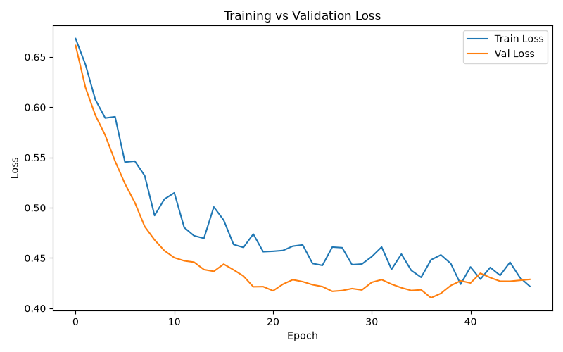
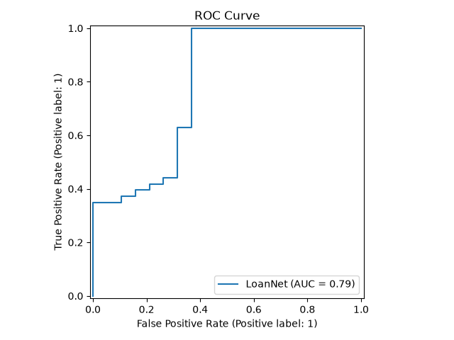
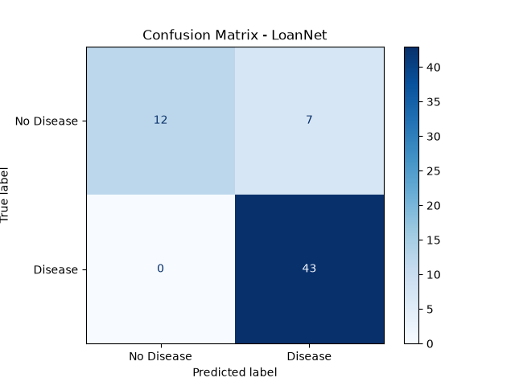

# Loan Approval Prediction API

A deep learning system that predicts loan approval probability using a PyTorch neural network — served via a FastAPI REST API, tracked with MLflow, and containerized with Docker.

---

## What It Does

Given a loan applicant's details, the API returns:
- **Approval probability** (0 to 1)
- **Decision** (Approved / Rejected)

```json
POST /predict

{
  "approval_probability": 0.8921,
  "prediction": 1,
  "decision": "Approved"
}
```

---

## Architecture

```
Raw Data (Loan Prediction Dataset)
        ↓
  preprocess.py         clean → encode → split → scale
        ↓
  dataset.py            PyTorch Dataset + DataLoader
        ↓
  model.py              HeartDiseaseNet — 64→32→1 with Dropout + BatchNorm
        ↓
  train.py              Manual training loop + early stopping + MLflow
        ↓
  MLflow Tracking       Loss curves per epoch
        ↓
  models/model.pt       Best weights saved to disk
        ↓
  api/main.py           FastAPI serves predictions
        ↓
  Docker Container      Portable, deployable anywhere
```

---

## Model Results

| Metric | Score |
|---|---|
| F1 (weighted) | 0.88 |
| ROC-AUC | 0.79 |
| Accuracy | 0.89 |

---

## Evaluation Plots

### Training vs Validation Loss


### ROC Curve


### Confusion Matrix


---

## Key Engineering Decisions

**Manual training loop** — unlike sklearn's `model.fit()`, the training loop is written explicitly. Each epoch: forward pass → loss → backprop → weight update. Gives full visibility into what the model does during training.

**Early stopping** — monitors validation loss each epoch. If it doesn't improve for 10 consecutive epochs, training stops and best weights are restored. Prevents overfitting without manual tuning of epoch count.

**Dropout + BatchNorm** — dropout randomly zeros 30% of neurons each forward pass during training to prevent co-dependency. BatchNorm normalizes layer outputs for stable, faster training.

**Shared preprocessing** — `preprocess.py` used by both `train.py` and `api/main.py`. Same transformations at training and inference — no train/serve skew.

---

## Tech Stack

| Layer | Tool |
|---|---|
| Deep Learning | PyTorch |
| Experiment Tracking | MLflow |
| API | FastAPI + Pydantic |
| Server | Uvicorn |
| Serialization | Joblib + torch.save |
| Containerization | Docker |
| Testing | Pytest |

---

## Project Structure

```
neural-net-classifier/
├── data/                   # Raw dataset (gitignored)
├── models/                 # Saved model artifacts (gitignored)
├── src/
│   ├── preprocess.py       # Shared preprocessing functions
│   ├── dataset.py          # PyTorch Dataset + DataLoader
│   ├── model.py            # Neural network architecture
│   ├── train.py            # Training loop + early stopping
│   └── evaluate.py         # Metrics, plots
├── api/
│   ├── main.py             # FastAPI application
│   └── schemas.py          # Pydantic input/output schemas
├── tests/
│   └── test_api.py         # API endpoint tests
├── Dockerfile
├── Makefile
└── requirements.txt
```

---

## Setup and Run

```bash
python3 -m venv venv && source venv/bin/activate
pip install -r requirements.txt
```

**Download dataset:** [Loan Prediction Dataset](https://www.kaggle.com/datasets/altruistdelhite04/loan-prediction-problem-dataset) → place CSV in `data/`

```bash
# Train the model
make train

# View MLflow experiment
make mlflow
# Open http://localhost:5000

# Start the API
make serve
# Open http://localhost:8000/docs
```

**Run with Docker:**
```bash
make docker-build
make docker-run
```

**Run tests:**
```bash
make test
```

---

## Sample API Call

```bash
curl -X POST http://localhost:8000/predict \
  -H "Content-Type: application/json" \
  -d '{
    "Gender": "Male",
    "Married": "Yes",
    "Dependents": "0",
    "Education": "Graduate",
    "Self_Employed": "No",
    "ApplicantIncome": 8000,
    "CoapplicantIncome": 2000,
    "LoanAmount": 150,
    "Loan_Amount_Term": 360,
    "Credit_History": 1.0,
    "Property_Area": "Urban"
  }'
```
