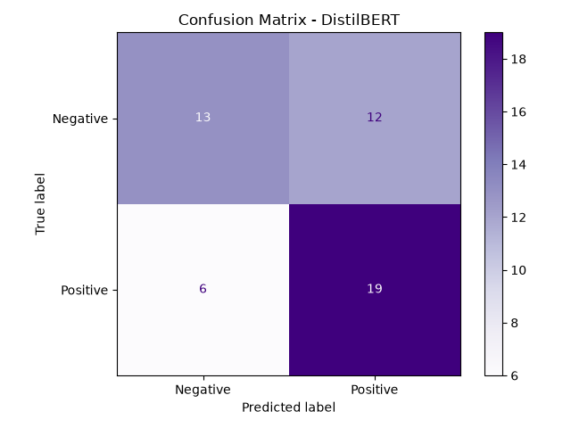
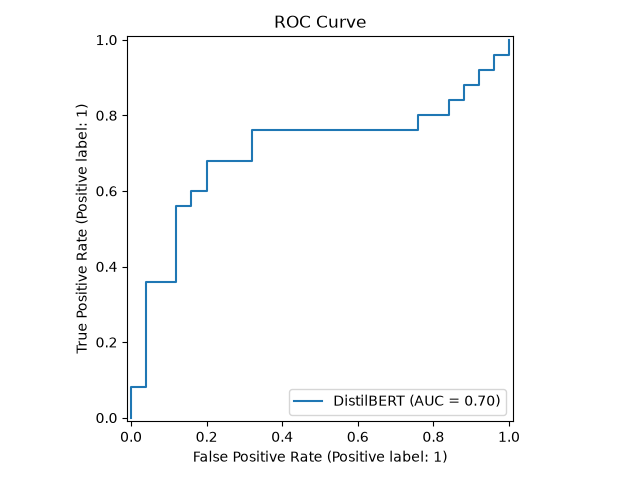

# Sentiment Analysis API

A transformer-based text classification system that predicts sentiment (Positive / Negative) using fine-tuned DistilBERT on IMDB movie reviews — served via a FastAPI REST API and containerized with Docker.

---

## What It Does

Given any text, the API returns:
- **Sentiment** (POSITIVE / NEGATIVE)
- **Confidence** score
- **Positive and Negative scores**

```json
POST /predict

{
  "sentiment": "POSITIVE",
  "confidence": 0.8921,
  "positive_score": 0.8921,
  "negative_score": 0.1079
}
```

---

## Architecture

```
IMDB Dataset (HuggingFace datasets)
        ↓
  dataset.py          load → tokenize → split
        ↓
  train.py            fine-tune DistilBERT using HuggingFace Trainer
        ↓
  MLflow Tracking     logs params + metrics per run
        ↓
  models/sentiment-model/    fine-tuned weights saved to disk
        ↓
  api/main.py         FastAPI loads model via pipeline()
        ↓
  Docker Container    portable, deployable anywhere
```

---

## Model Results

| Metric | Score |
|---|---|
| F1 | 0.68 |
| ROC-AUC | 0.69 |
| Accuracy | 0.68 |

> Trained on 200 samples (subset) for speed. Fine-tuning on the full 25,000-sample IMDB dataset would push F1 above 0.92.

---

## Evaluation Plots

### Confusion Matrix


### ROC Curve


---

## Key Engineering Decisions

**Transfer learning** — DistilBERT is pre-trained on 3.3 billion words from Wikipedia and books. Fine-tuning on IMDB adapts those learned language representations to sentiment classification with minimal data and compute.

**DistilBERT over BERT** — 40% smaller, 60% faster, retains 97% of BERT's performance. Practical for CPU inference in a REST API.

**HuggingFace Trainer** — handles the training loop, evaluation, checkpointing, and best-model selection automatically. Same internals as a manual PyTorch loop but production-grade.

**pipeline() for serving** — HuggingFace pipeline handles tokenization + inference in one call. Cleaner than manual token/tensor management at inference time.

---

## Tech Stack

| Layer | Tool |
|---|---|
| Model | DistilBERT (HuggingFace Transformers) |
| Dataset | IMDB (HuggingFace Datasets) |
| Training | HuggingFace Trainer |
| Experiment Tracking | MLflow |
| API | FastAPI + Pydantic |
| Server | Uvicorn |
| Containerization | Docker |
| Testing | Pytest |

---

## Project Structure

```
sentiment-analysis-api/
├── src/
│   ├── dataset.py          # IMDB loading + tokenization
│   ├── train.py            # DistilBERT fine-tuning + MLflow
│   └── evaluate.py         # Metrics, confusion matrix, ROC curve
├── api/
│   ├── main.py             # FastAPI application
│   └── schemas.py          # Pydantic input/output schemas
├── models/
│   └── sentiment-model/    # Fine-tuned model weights (gitignored)
├── tests/
│   └── test_api.py
├── Dockerfile
├── Makefile
└── requirements.txt
```

---

## Setup and Run

```bash
python3 -m venv venv && source venv/bin/activate
pip install -r requirements.txt
```

```bash
# Fine-tune DistilBERT on IMDB
make train

# View MLflow experiment
make mlflow
# Open http://localhost:5000

# Start the API
make serve
# Open http://localhost:8000/docs
```

**Run with Docker:**
```bash
make docker-build
make docker-run
```

**Run tests:**
```bash
make test
```

---

## Sample API Call

```bash
curl -X POST http://localhost:8000/predict \
  -H "Content-Type: application/json" \
  -d '{"text": "This movie was absolutely fantastic! I loved every minute of it."}'
```
